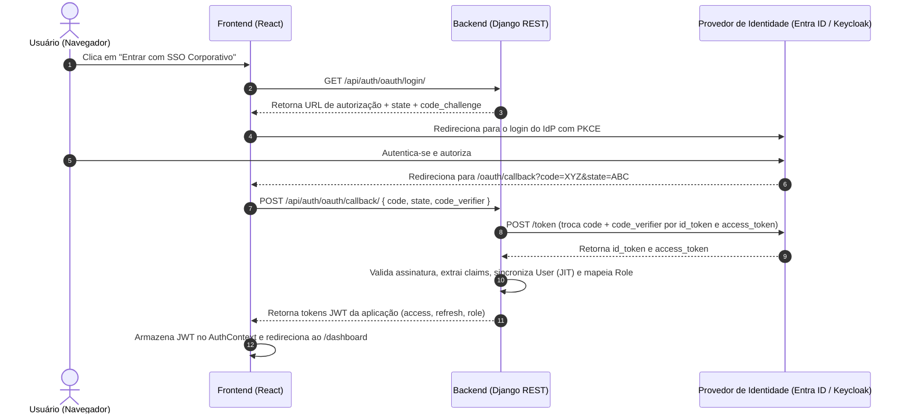

# Spec: Módulo autenticacao-oauth (Autenticação Corporativa OAuth 2.0 / OIDC)

## Objective
Fornecer autenticação corporativa segura e padronizada para o Sistema de Gestão do PLAC (Telebras) via **OAuth 2.0 e OpenID Connect (OIDC)** (compatível com Microsoft Entra ID, Gov.br ou Keycloak), permitindo:
1. **Single Sign-On (SSO):** Acesso simplificado e seguro para demandantes, diretores e analistas da GCC com suas credenciais institucionais, sem necessidade de senhas locais.
2. **Provisionamento Just-in-Time (JIT):** Criação ou sincronização automática da conta do usuário no primeiro login com base nas informações do IdP (nome, e-mail, matrícula/lotação).
3. **Mapeamento de Perfis (RBAC):** Mapeamento dinâmico das claims/grupos do IdP para os papéis de negócio do PLAC (`DEMANDANTE`, `DIRETOR`, `ANALISTA_GCC`, `DIRETOR_DAFRI`, `DIRETORIA_EXECUTIVA`).
4. **Interoperabilidade JWT:** Emissão de tokens JWT (SimpleJWT) pelo backend após o fluxo OAuth para manter total compatibilidade com o ecossistema existente da API REST e frontend React.

---

## Tech Stack & Commands

- **Backend:** Python 3.11, Django 4.2+, Django REST Framework, `authlib` / `requests`, `rest_framework_simplejwt`.
- **Frontend:** React 18, Vite, Tailwind CSS, Lucide Icons, Axios.
- **Protocolos:** OAuth 2.0 com Authorization Code Flow e PKCE (Proof Key for Code Exchange) + OIDC Discovery (`.well-known/openid-configuration`).
- **Banco de Dados:** PostgreSQL (extensão do modelo `users.User`).

### Comandos de Verificação
- **Backend Tests:** `docker exec plac-mvp-backend-1 python manage.py test users.test_oauth --no-input`
- **Backend Migrations:** `docker exec plac-mvp-backend-1 python manage.py makemigrations users && docker exec plac-mvp-backend-1 python manage.py migrate`
- **Frontend Build:** `docker exec plac-mvp-frontend-1 npm run build`
- **Frontend Lint:** `docker exec plac-mvp-frontend-1 npm run lint`

---

## Project Structure

```text
backend/
├── core/
│   └── settings.py               # Configurações de OAuth/OIDC (Client ID, Secrets, Endpoints)
└── users/
    ├── models.py                 # Extensão do User (oauth_provider, oauth_sub, lotacao)
    ├── services_oauth.py         # Cliente OIDC: discovery, validação de state/PKCE, token exchange, userinfo
    ├── serializers.py            # Serializers de login OAuth e claims
    ├── views.py                  # Endpoints /api/auth/oauth/login/ e /api/auth/oauth/callback/
    ├── urls.py                   # Registro das rotas de autenticação
    └── test_oauth.py             # Bateria de testes automatizados com mocks de IdP

frontend/
├── src/
│   ├── context/
│   │   └── AuthContext.jsx       # Integração do login OAuth com persistência de token JWT
│   ├── pages/
│   │   ├── Login.jsx             # Botão de Login Corporativo SSO (OAuth) + Fallback local
│   │   └── OAuthCallback.jsx     # Rota /oauth/callback para troca de código e redirecionamento
│   └── App.jsx                   # Rota do callback registrada no roteador
```

---

## Code Style & Architecture

### 1. Fluxo de Autenticação OAuth 2.0 com PKCE


### 2. Padrão de Código do Serviço de Callback (`services_oauth.py`)
```python
import requests
from django.conf import settings
from django.contrib.auth import get_user_model
from rest_framework_simplejwt.tokens import RefreshToken

User = get_user_model()

def exchange_code_and_sync_user(code: str, code_verifier: str) -> dict:
    """
    Troca o authorization code pelo token no IdP, obtém userinfo e
    realiza o provisionamento Just-in-Time com emissão de SimpleJWT.
    """
    token_url = settings.OAUTH_TOKEN_URL
    payload = {
        'grant_type': 'authorization_code',
        'client_id': settings.OAUTH_CLIENT_ID,
        'client_secret': settings.OAUTH_CLIENT_SECRET,
        'code': code,
        'redirect_uri': settings.OAUTH_REDIRECT_URI,
        'code_verifier': code_verifier,
    }
    response = requests.post(token_url, data=payload, timeout=10)
    response.raise_for_status()
    token_data = response.json()
    
    # Obter dados do usuário
    user_info = get_userinfo_from_idp(token_data.get('access_token'))
    sub = user_info['sub']
    email = user_info.get('email', f"{sub}@telebras.com.br")
    name = user_info.get('name', '')

    # Mapeamento dinâmico de perfil (RBAC) baseado em claims ou grupos
    role = map_claims_to_role(user_info)

    user, created = User.objects.update_or_create(
        oauth_sub=sub,
        defaults={
            'username': email.split('@')[0],
            'email': email,
            'first_name': name,
            'role': role,
            'oauth_provider': settings.OAUTH_PROVIDER_NAME,
        }
    )

    refresh = RefreshToken.for_user(user)
    refresh['role'] = user.role
    refresh['username'] = user.username

    return {
        'access': str(refresh.access_token),
        'refresh': str(refresh),
        'user': {
            'username': user.username,
            'email': user.email,
            'role': user.role,
        }
    }
```

---

## Testing Strategy

- **Testes Unitários:**
  - Mock de requisição para o endpoint de Token e UserInfo do IdP.
  - Teste do mapeamento de roles com diferentes grupos corporativos (`ADMIN_GCC` -> `ANALISTA_GCC`, `DIR_REQUISITANTE` -> `DIRETOR`, etc.).
  - Validação de expiração de state ou rejeição de `code_verifier` adulterado.
- **Testes de Integração:**
  - `POST /api/auth/oauth/callback/` com dados válidos criando o usuário (JIT) e devolvendo JWT 200 OK.
  - Tentativa de autenticação com IdP indisponível retornando erro amigável HTTP 502/503.
  - Manutenção do fallback: `POST /api/token/` continua funcionando para usuários locais de homologação.

---

## Boundaries

- **Always:**
  - Utilizar fluxo com PKCE e validação estrita de parâmetro `state` anti-CSRF.
  - Validar audiência (`aud`) e emissor (`iss`) do token recebido do IdP.
  - Armazenar credenciais de cliente OAuth (`OAUTH_CLIENT_SECRET`) exclusivamente em variáveis de ambiente `.env`.
- **Ask first:**
  - Desativar a autenticação local legado por usuário e senha (`/api/token/`).
  - Alterar o comportamento padrão de criação de usuário caso a claim de grupo venha vazia (atribuir `DEMANDANTE` ou bloquear acesso).
- **Never:**
  - Expor `client_secret` no código frontend ou na URL do navegador.
  - Aceitar tokens de autenticação sem validação criptográfica de integridade.
  - Armazenar senhas em texto puro ou bypassar as permissões de role do DRF.

---

## Success Criteria

1. **Autenticação com 1 clique:** Usuário clica no botão SSO e realiza o ciclo completo de login retornando autenticado para o Dashboard.
2. **Provisionamento JIT:** Usuários corporativos são criados e atualizados dinamicamente sem necessidade de inserção prévia manual no banco.
3. **Mapeamento de Papéis:** O usuário assume automaticamente o papel de `DEMANDANTE`, `DIRETOR` ou `ANALISTA_GCC` conforme seu perfil corporativo.
4. **Resiliência:** Cobertura de 100% de testes automatizados no backend cobrindo sucesso, falha de token e contingência local.
5. **Compatibilidade:** O frontend consome os mesmos tokens JWT sem quebrar componentes existentes (`AuthContext`, `api.js`).

---

## Open Questions

> [!IMPORTANT]
> **Definições necessárias com a equipe de infraestrutura/negócio:**
> 1. **Provedor Primário:** O IdP oficial será o Microsoft Entra ID (Azure AD Telebras), Gov.br (Login Único Brasil Cidadão) ou Keycloak interno?
> 2. **Regra de Mapeamento de Papéis:** O IdP enviará grupos/roles nas claims (ex: `roles: ["GCC_OPERADOR"]`), ou no primeiro acesso o perfil default deve ser `DEMANDANTE` com elevação manual por administrador?
> 3. **Modo Híbrido:** O login por usuário e senha local (`admin`, `demandante`, etc.) deve permanecer habilitado como fallback para desenvolvimento e contingência?
